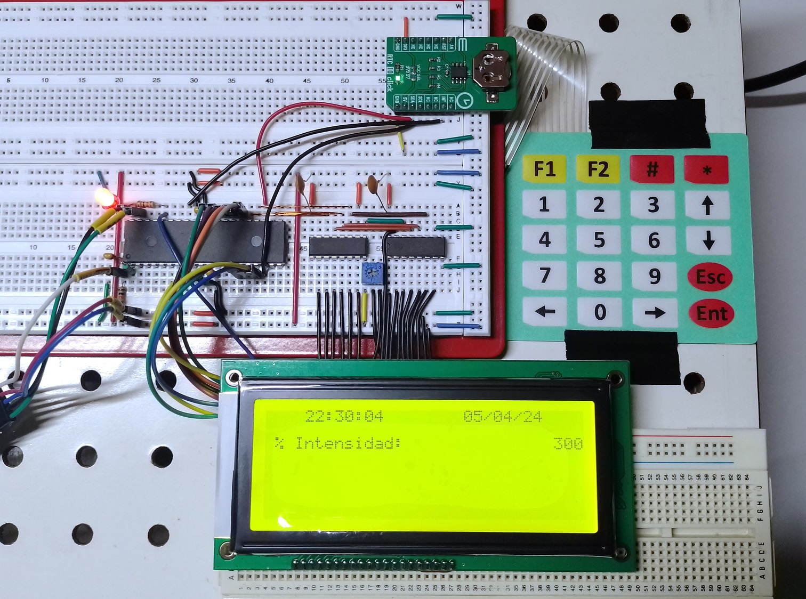

# General purpose HMI

Physical implementation of a Human-Machine Interface (HMI) with keyboard, screen and real-time clock, highly customizable for any type of project and suitable for embedded systems with low memory and processing resources.
In this case the code has been implemented for a PIC18F microcontroller but the algorithm can be easily translated to ESP32, Arduino, etc.

## Technologies

### Software:
* MPLAB X IDE v6.00
* XC8 compiler v2.40
* MPLAB Code Configurator v5.1.17

### Hardware:
* MPLAB ICD 4 In-Circuit Debugger (or another modern PIC's programmer)
* PIC18F47Q43 microcontroller
* 5x4 matrix keyboard
* LCM19264A graphical LCD display
* DS3231 IC (Real-Time Clock)

## Assembly of the first prototype

As an example of how this first stage works, an options menu was implemented with simple navigation, the ability to modify the display lighting, and modify the date and time values of the real-time clock. [Video here](https://youtu.be/YLmx6O5Ore4).

Functions for menu navigation and entering numerical and time data from the keyboard have been created, so the developer can focus on the active part of the application and not have to make the HMI from scratch.